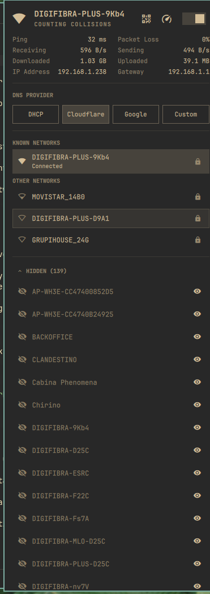

# wifiomarchy

An [Omarchy](https://omarchy.org/) Wi-Fi bar widget — a fork of the built-in
`omarchy.network` that lets you **hide networks you don't want to see while
scanning**.

Living in an apartment, a Wi-Fi scan can list every network belonging to your
neighbours. With this plugin you can mark any network as *hidden*, and it will
never appear in a scan again — while the network you're currently connected to
always stays visible.

## Screenshot



## Features

- Connect / disconnect / forget networks (everything the stock widget does).
- **Hide** any network from future scans (eye-off button).
- **Hide a saved network** (one you've connected to before): its profile is
  forgotten too, so it stops auto-connecting and disappears from the list.
- A **HIDDEN** section at the bottom of the panel lists hidden networks, so a
  mistaken hide can be undone with one click (eye button). It's collapsed by
  default — click the header to expand it.
- Hidden networks are persisted in
  `~/.local/state/omarchy/wifi-hidden-networks.json` and survive shell
  restarts and `omarchy update`.

## Requirements

This plugin runs inside Omarchy's shell and uses these built-in Omarchy
commands, which ship with every Omarchy install:

- `omarchy-network-status` — connection details and throughput.
- `omarchy-network-band` — Wi-Fi band selection.

No other dependencies.

## Install

```bash
omarchy plugin add https://github.com/cdelcollado/wifiomarchy --enable
```

If the widget doesn't appear in your bar automatically, place it:

```bash
omarchy plugin enable cdelcollado.network
```

**Note:** `allowMultiple` is `false`, so make sure the built-in
`omarchy.network` is disabled if you have both installed.

## Usage

1. Click the Network icon in the bar.
2. Let it scan (or keep the panel open — it rescans automatically).
3. Hover a network and click the eye-off button (`󰈉`):
   - under **OTHER NETWORKS**, the tooltip reads "Hide network" and the network
     is simply hidden from scans;
   - under **KNOWN NETWORKS**, the tooltip reads "Forget & hide" — the saved
     profile is forgotten too, so it stops auto-connecting.
4. To restore a network, open the **HIDDEN** section at the bottom and click
   the eye button (`󰈈`, tooltip "Show again"). A network hidden while saved
   comes back as an available network, without its saved credentials.

## Development

The interesting bits:

- `Model.js` — network helpers (row projection, sorting, section titles).
- `Panel.qml` — the panel UI, the hide/unhide buttons, and JSON persistence.

Validate a local copy before publishing:

```bash
omarchy plugin validate .
```

## License

[MIT](LICENSE). Derived from Omarchy's `omarchy.network` first-party plugin,
also MIT licensed. See [Omarchy](https://omarchy.org/) for upstream licensing.
